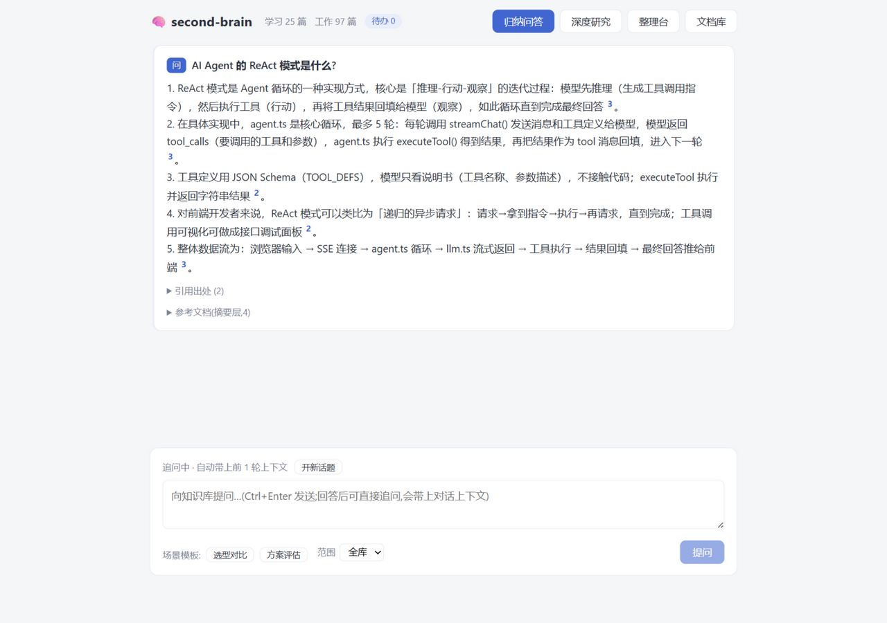
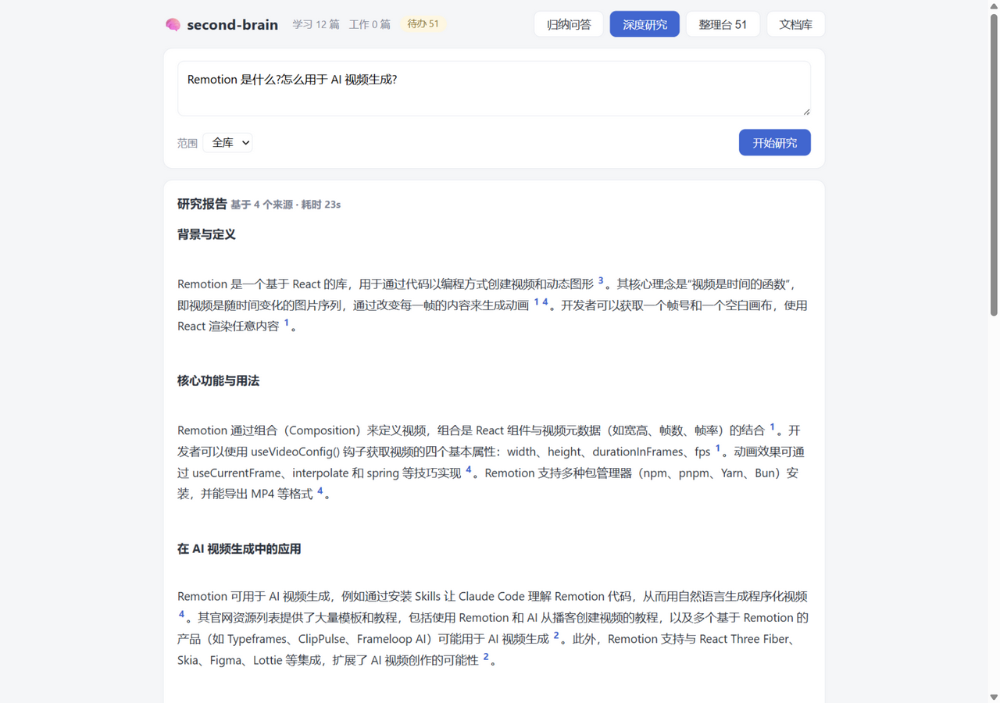
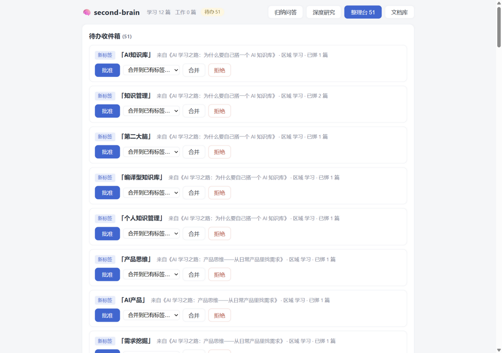
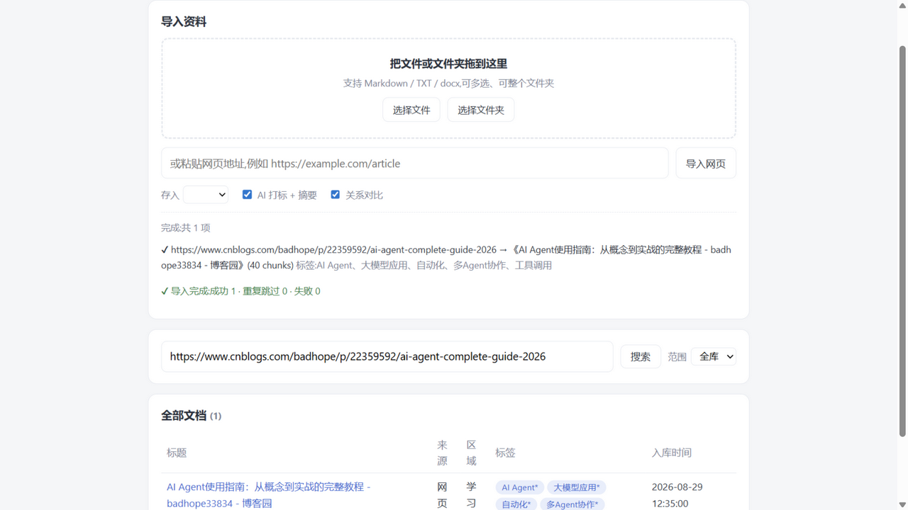
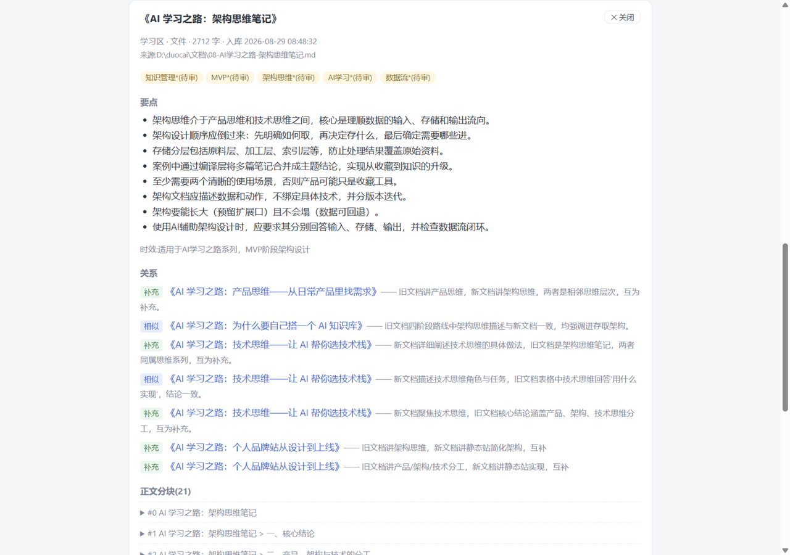
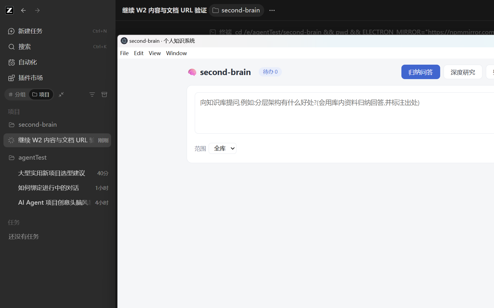
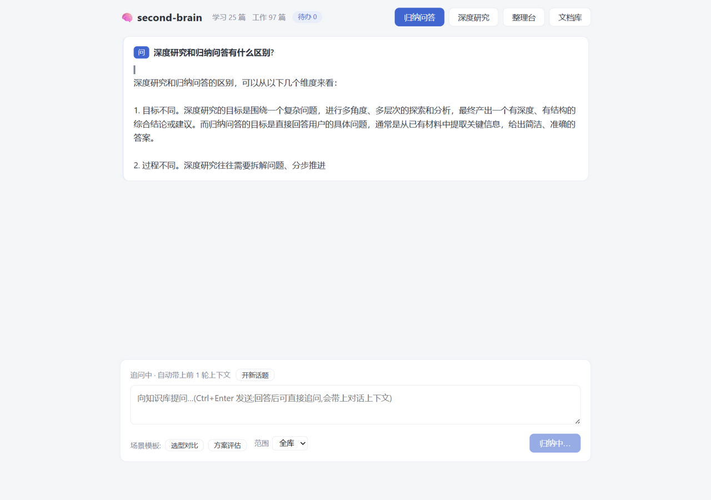

# second-brain · 编译型个人知识系统

> 一个运行在本机的 AI 知识库:资料进门自动打标、写摘要、建关系;问答带段落级引用;联网深度研究;检索是**词面 + 语义双路混合召回**。桌面客户端,数据完全本地。

<p align="center">
  
</p>

## 为什么不是又一个收藏夹

书签、Notion、Obsidian 能存信息,但内容长期停留在"原始信息"层。second-brain 的核心思路是**编译**:在资料入库时一次性完成 AI 加工(结构化摘要、标签、跨文档关系、主题结论页),之后的问答与创作直接复用这些加工结果,而不是每次重新阅读原文。

三个变化:

- 从**保存**原始信息 → **持续加工**知识
- 从**关键词找文件** → **理解问题**并综合回答
- 从**被动回答** → 主动提示**该做什么**(待编译主题、回顾建议)

## 界面

| 深度研究(联网+带引用报告) | 整理台(所有 AI 建议在此裁决) |
|---|---|
|  |  |

| 拖拽/网址/随手记导入 | 文档详情(摘要/关系/分块/原文快照) |
|---|---|
|  |  |

| Electron 桌面端 | 流式输出 |
|---|---|
|  |  |

## 核心设计

### 四层存储,数据不塌

```
原料层  documents + snapshots   只读副本,内容寻址,永不覆盖
加工层  summaries / topics      入库时 AI 加工,可随时全量重算
关系层  tags / relations         相似/冲突/补充;冲突只记录,裁决权在用户
索引层  FTS5 trigram + embeddings 词面与语义双路检索
流程层  inbox + settings         所有 AI 建议进收件箱,等用户拍板
```

原文不可变是第一原则:URL 入库即存快照,任何"更新"只发生在派生层,错误可核对、过程可回退。

### 混合召回:词面 + 语义双路 RRF 融合

```
问题 ──┬─ 词面路:FTS5 trigram 短语 → 2字gram LIKE(稀有度加权) ─┐
       │                                                      ├─ RRF 融合 → 材料
       └─ 语义路:bge-small-zh 查询向量 → 余弦 top-K ────────────┘
```

- 词面路**零 token、毫秒级**,精确术语命中;
- 语义路(本地 onnx 推理 bge-small-zh,512 维)补"同义不同词"的盲区;
- 两路用 **RRF(倒数排名融合,K=60)**合并,每条引用标注来源路(词面/语义/词面+语义),检索可解释。

### 编译层:主题结论页

同一标签下文档聚到一定数量,整理台出现"建议编译"→ AI 综合各篇摘要生成**主题结论页**(冲突并列呈现、结论引用回来源)。新资料入库自动标记"待重编译"。这层是传统 RAG 没有的:理解工作在入库时完成,查询时直接复用成品。

### 引用防幻觉

回答中的 `[n]` 编号是系统编的:后处理会把**材料里不存在的编号直接摘除**,引用必须能落回到具体文档的具体小节。引用出处默认折叠,点角标自动展开定位。

### 整理台:裁决权在人

LLM 提的所有新标签、发现的所有冲突、暂存的产出、评估集的校准建议——全部进收件箱等用户决定,系统永远不自动"修正"知识。每次裁决留审计记录。

## 评估数据

16 例评估集(含 4 例"措辞与文档用词不同"的语义用例),三项指标全部确定性判定:

| 指标 | 纯词面检索 | 混合召回(词面+语义) |
|---|---|---|
| 引用命中 | 63% | **75%** |
| 要点覆盖 | 69% | **75%** |
| 回答可用 | 100% | 100% |
| 平均耗时 | 3.5s | 3.6s |

- **引用命中**:回答的编号引用落在期望文档上(引错文档=答错);
- **要点覆盖**:预设关键事实词(同义词组任一命中)出现在回答里;
- **回答可用**:有引用且材料充分。

评估集本身会随库内容"漂移"——内置**自动校准**:AI 判断未命中用例是"期望过时"还是"真检索失败",给出建议、用户拍板更新期望。

## 成本模型

设计上是**成本前移**:理解工作在入库时花一次钱,之后永久复用。

- 检索 / 找文档 / 整理台:**零 token**(全部本机 SQLite);
- 入库打标+摘要:每篇一次调用(分钱级),终身复用;
- 问答:一次流式归纳(1~2 分钱);研究:约十次调用;
- 向量:本地 onnx 推理,零 API 成本。

## 快速开始

**方式一:免安装 exe(Windows)**

```
双击 release/win-unpacked/second-brain.exe
```

首次使用:整理台填"规则层"(你的技术栈与偏好)→ 文档库拖入资料 → 开始提问。

**方式二:开发态**

```bash
npm install
npm run web        # 本机 Web(127.0.0.1:8790)
npm run desktop    # 或 Electron 开发态
npm run dist       # 打包 exe(数据目录与打包隔离,升级不丢数据)
```

`.env` 需配置 `LLM_API_KEY`(DeepSeek)。向量默认本地推理,模型首次构建时自动经 hf-mirror 下载;也可配 `EMBEDDING_API_KEY` 切换 API 嵌入,或 `EMBEDDING_PROVIDER=off` 关闭语义路。

## 技术栈

Electron 44 · Node 24(node:sqlite,零编译)· Vue3(无构建链)· esbuild · transformers.js(onnxruntime)· DeepSeek

- 服务只绑 `127.0.0.1`,数据住在应用目录之外,重打包/升级零影响;
- 启动自动做数据库一致性快照(VACUUM INTO),滚动保留 7 份;
- 全量导入管线、CLI、评估跑分器(`npm run cli -- eval`)齐备。

## 踩坑实录(节选)

1. **FTS5 trigram 的 3 字符下限**:2 字中文词建不进索引,必须 LIKE 兜底;60 字连续短语在"同主题不同表述"间永远字符级命中不了。
2. **LIKE 兜底的行序偏置**(评估集抓出):逐词 `LIMIT` 按 rowid 取候选,库后面的文档永远轮不到;`%MV%` 还会撞上 "MVP"。改单次加权 OR 扫描 + 词边界校验。
3. **材料被单文档垄断**:问答材料按 bm25 全序取前 N,会被一篇文档的高分 chunk 挤满,模型退化成单文档摘要机——改按文档配额轮转。
4. **数据与代码必须物理分离**:打包版数据曾放在应用目录内,重打包整个重建应用目录导致数据清空——现数据住在系统用户目录,启动自动备份。
5. **追问需要指代补全**:"它怎么部署?"按字面检索必然落空——先让 LLM 结合前文改写成独立问题再检索。
6. **机械工作给脚本,语义判断给 AI**:切块/去重/索引是脚本,打标/关系/编译是 AI——这条分工贯穿全项目。

## 边界(刻意不做)

多用户与登录、插件系统、向量数据库服务、定时自动整理(烧钱且违背"裁决权在人")——个人单机工具,不为简历关键词堆组件。

## License

MIT
