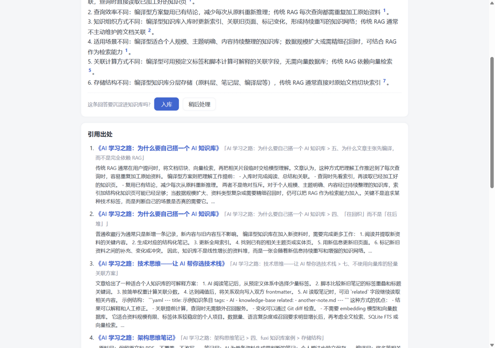

# second-brain 周报(W1–W5):个人知识系统从零到可用

> 项目:E:\second-brain · 周期:2026-08(5 个工作周)
> 形态:本机 Node 服务 + Vue3 前端(8790 端口,只绑 127.0.0.1),W5 套 Electron 壳
> LLM:DeepSeek(DeepSeek-chat);数据库:node:sqlite(Node 24 内置,零编译)

## 界面一览

| 归纳问答(带编号引用) | 引用一键跳到出处 |
|---|---|
|  |  |

| 深度研究(联网+带引用报告) | 整理台(裁决待办) |
|---|---|
|  |  |

| 文档详情(要点/关系/分块) | Electron 桌面端(零业务返工套壳) |
|---|---|
|  |  |


## 一、这个系统是什么

两条"入库腿"共用一个知识库:

- **B 腿(导入)**:自有资料(MD/TXT/docx/网页 URL)→ 自动打标/结构化摘要/跨文档关系 → 归纳问答(每个论断引用到具体段落)
- **A 腿(研究)**:联网深度研究 → 带编号引用的报告 → 报告+来源快照一键沉淀入库,自动与旧知识建关系边

加上一个**整理台**:LLM 提的所有新标签、发现的所有冲突、暂存的产出,全部进收件箱等用户裁决——系统永远不自动"修正"知识。

## 二、每周交付

| 周 | 交付 | 核心决策 |
|---|---|---|
| W1 | 四层 schema(原文/元数据/流程/配置)、FTS5 trigram 中文检索、四类解析器、结构感知切块、LLM 打标+摘要(校验器+重试+兜底)、入库关系对比、全命令 CLI | 原文不可变:URL 入库即存内容寻址快照;关系只记 similar/conflict/supplement,冲突裁决权在用户 |
| W2 | 可替换检索器(三级召回)、归纳问答(编号引用)、入库候选确认交互、Web 起步 | 摘要层是入库时花过钱的蒸馏,问答零成本复用;材料外引用编号一律视为幻觉摘除 |
| W3 | Deep Research 全管线(Bing 零 key 搜索器)、报告按 Markdown 标题切块入库、来源免二次抓取、Web 研究页(后台任务+轮询) | 矛盾并列呈现不裁决;A/B 两腿在关系层自动汇合 |
| W4 | 整理台:标签批准/合并/拒绝、冲突并排裁决、打标重试、暂存恢复入库;词表管理表;裁决审计 | 合并=绑定迁移+merged_into 指针,读取路径零改动;裁决触发确定性重算(问答不再误报) |
| W5 | 评估集跑分器、Electron 桌面壳(业务零返工)、录屏演示、本篇周报 | 评估只做确定性判定(引用命中/要点覆盖/可用率),不做 LLM 自评分 |

## 三、架构一页图

```
                    ┌─────────────── 整理台(裁决)───────────────┐
                    │  标签批准/合并   冲突裁决   打标重试   暂存入库 │
                    └──────────────────┬───────────────────────┘
                                       │ resolution 审计
B 腿:MD/TXT/docx/URL ──► 解析 → 指纹去重 → 快照 ──► chunks(heading_path)
                                        │           │
A 腿:研究问题 → 检索词计划 → Bing 搜索 ──┤           ├─► FTS trigram 索引
        抓正文 → 要点提取 → 带引用报告 ──┘           │
                                       ▼           ▼
                     tags(受控词表,merged_into 合并链)
                     summaries(key_points,问答的摘要层)
                     relations(相似/冲突/补充,冲突待裁决)
                                       │
                     归纳问答:摘要层+chunk 材料 → LLM → [n] 引用
```

## 四、评估集跑分(W5 实测)

评估集:12 个问答对,覆盖全部 12 篇库内文档;三个硬指标全部确定性判定:

- **引用命中**:回答的编号引用落在期望文档上(引错文档=答错)
- **要点覆盖**:预设关键事实词(同义词组任一命中)出现在回答里
- **回答可用**:有引用且模型自认材料充分

| 指标 | 结果 |
|---|---|
| 引用命中 | **100%**(12/12) |
| 要点覆盖 | **92%**(11/12) |
| 回答可用 | **100%**(12/12) |
| 平均耗时 | **2.3s**/问 |

要点覆盖失分的是"选 AI 音乐引擎"一例:回答可用、引用正确,只是没写出 Suno 这个品牌词。两轮跑分失分的是**不同案例**(另一轮是"合规复刻"没写"版权"二字,但答了"著作权法/授权")——证实是 LLM 措辞方差,不是知识缺口。

**评估集第一天就抓到一个真 bug**(这是跑分器最值钱的一单):"怎么把做好的歌做成 AI MV?"零引用,期望文档完全没被召回。根因是 LIKE 兜底层按行序 `LIMIT` 逐词取候选——"MV"的前 100 个命中被库内前几篇文档的"MVP"占满,排在库后面的《AI MV》一篇从没进过候选;子串碰撞(%MV% 命中 MVP)还污染了稀有度权重。修复:改成**单次加权 OR 扫描**(SQL 按稀有度权重打分排序,全表无偏)+ ASCII 词**词边界校验**(MV≠MVP)。修复后该案例从 0 分到满分,其余 11 例无回归。

跑分器:`npm run cli -- eval`,明细在 `eval/results.json`。评估就是真实问答,零额外开发成本。

## 五、成本模型(实测口径)

- **检索/找文档/整理台:零 token**。bm25/LIKE 全在本机 SQLite;
- **花钱点 1|入库打标+摘要**:每篇 1 次结构化调用(几分钱),摘要终身复用;
- **花钱点 2|关系对比**:入库时 FTS 粗筛 top-6 → 1 次精判;
- **花钱点 3|问答**:1 次归纳(1~2 分钱);**研究**:约 10 次(计划 1+要点 N+报告 1);
- 全程无向量库、无嵌入费用——词面三级召回在个人库规模(万级 chunk)够用,向量检索留了 Retriever 接口随时可挂。

## 六、踩坑实录(最值钱的部分)

1. **FTS5 trigram 的 3 字符下限**:2 字中文词建不进索引,必须 LIKE 兜底;60 字连续短语在"同主题不同表述"间永远字符级命不中——滑窗 OR 探针 + bm25 密度排序才对。
2. **跨词边界探针会漏**:"分层架构"切成"分层架/层架构",语料里若没有这种连续序列就查不到——补 2 字 gram LIKE(稀有度加权近似 IDF),不再用"命中≥N 词"硬阈值(会误杀单词查询)。
3. **材料被单文档垄断**:问答材料按 bm25 全序取前 8,会被一篇文档的高分 chunk 挤满,模型退化成单文档摘要机——改按文档配额轮转,多文档归纳才成立。
4. **搜索源的网络现实**:DuckDuckGo 直连超时(被墙),搜索器必须做成可替换接口,Bing HTML 解析顶上。
5. **反爬是常态**:知乎 403、纯 JS 渲染页正文 0 字——单页失败只降级不阻塞,失败清单如实呈现给用户。
6. **Windows 进程树**:杀 npm 包装进程不杀 node 子进程,8790 端口残留要 netstat+taskkill;Electron 退出时用 taskkill /T /F 收进程树。
7. **测试脚本编码**:Git Bash 里 curl -d 发 GBK,服务端按 UTF-8 解必乱码——自动化测试走文件 + --data-binary。
8. **问答自增强**:问答沉淀入库后,同一问题再问会命中原答案(引用自己的旧回答)。行为正确(那就是已裁决的知识),但评测时要知道这层。
9. **LIKE 兜底的行序偏置**(评估集抓出):逐词 `LIMIT 100` 取候选,库后面的文档永远轮不到;`%MV%` 还会撞上 "MVP"。单次加权 OR 扫描 + 词边界校验解决——细节见第四节。
10. **Electron 拉 .cmd 子进程**:Windows 上 spawn 'npx.cmd' 不带 `shell:true` 会抛 EINVAL(Node 20+ 安全限制),且这个同步异常会打断 whenReady 回调链,窗口静默不出现——报错要自己兜,窗口开出来比白屏好排查。壳的另一原则:8790 已有服务就复用,不重复拉起。

## 七、下一步

- 正式数据导入(用户自理)+ 日常使用磨需求
- 向量检索器挂进 Retriever 接口(语义级"同主题不同表述"相似,补词面检索的天花板)
- 研究/问答流式输出;区域抓取白名单配置化
